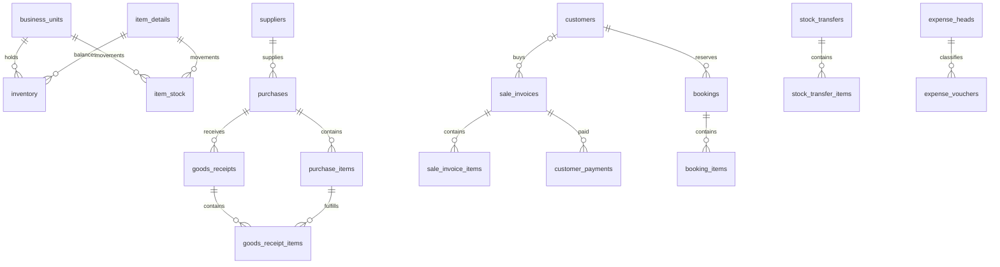

# Database schema baseline

54 ordered migrations create 51 application tables with 418 columns, 68 foreign keys and 3 enforced CHECK constraints. `_schema_migrations` is a separate infrastructure table. The numbered SQL files are the exact source of truth for column definitions; `db:verify` reads their contract and compares it with the running database.

## Relationships and purpose

| Area | Tables |
| --- | --- |
| Locations and security | business_units, access_groups, users, permissions, group_permissions, actions, modules, resources, access_ip_logs, access_control_settings |
| Catalog and parties | categories, sub_categories, item_types, item_units, manufacturers, shelve_locations, suppliers, customers, item_details |
| Stock and opening balances | inventory, item_stock, opening_stock, opening_stock_items |
| Purchasing | purchases, purchase_items, goods_receipts, goods_receipt_items, supplier_payments, purchase_returns, purchase_return_items |
| Sales | sale_invoices, sale_invoice_items, customer_payments, sale_returns, sale_return_items |
| Booking and compatibility | bookings, booking_items, booking_payments, customer_returns |
| Stock administration | reorders, stock_snapshots, stock_snapshot_items, stock_transfers, stock_transfer_items, expiry_tags |
| Upgrade infrastructure | booking_invoice_links, auth_login_limits |
| Accounting support | expense_heads, expense_vouchers, daybook, sequence_counters |

The diagram shows principal relationships, not all 66 constraints. Refer to individual SQL files for deletion/update actions; restricting master deletion and cascading applicable detail rows are integration-tested.

## Data conventions and resolved schema gaps

- Every application table explicitly uses InnoDB, utf8mb4 and utf8mb4_unicode_ci. Installation is tested under strict SQL mode with foreign-key checks enabled.
- Quantities involved in stock operations use decimals instead of truncating fractional units. Money uses fixed-point DECIMAL. This does not fix JavaScript rounding or service calculations.
- `inventory` is unique by item, unit and business location, with a nonnegative quantity CHECK. Different locations can hold separate balances of the same item/unit.
- `item_stock` is an append-only movement ledger with a primary ID, signed quantity, business unit, movement type, reference type/ID and creation timestamp. Multiple movements of the same item/location are valid. Source and item/location/time indexes support lookups. The existing global `item_details.stock` is retained for compatibility; reconciling all stock representations belongs to the next backend phase.
- Business-unit address/type/status fields, supplier opening balance, purchasing paid amount/location, receipt status/location, receipt-line purchase link/condition and price fields are present for existing SQL callers.
- Walk-in customer payments allow a null customer while still referencing the invoice. Users can omit an email for the existing admin creation path; provided emails remain unique.
- Access settings, expiry tags and customer returns now have explicit schemas. Settings bootstrap to disabled IP restrictions; migration does not pretend to implement application authorization.
- Foreign-key integer types and signedness match their parent keys. Missing catalog/location/document/user links have explicit constraints and indexed keys.
- CHECK constraints enforce nonnegative inventory, a singleton settings ID, and different transfer source/destination locations.

## Deliberate compatibility boundaries

`expense_vouchers.voucher_number` and `business_unit_id` remain nullable in the immutable original SQL. The upgraded voucher service allocates a unique EV number from the locked counter and sets posted status. Location remains optional for compatibility; there is no automatic location inference or SQL trigger. Posted amounts cannot be rewritten through the API.

The `ref_type`/`ref_id`, generic daybook reference and `customer_returns.source_type`/`source_id` fields are polymorphic references; one SQL foreign key cannot point to several possible source tables. Application validation is still required. Foreign keys also cannot prove that a receipt line's purchase item belongs to its header's purchase or that totals, balances and stock movements agree.

Snapshot tables retain the current global item/date structure, but their quantities now derive from the full movement ledger rather than purchase-order quantities or legacy stock. Tenant isolation, offline conflict handling, soft deletion, tax rules, append-only enforcement for accounting entries and transaction idempotency are outside this database baseline. See the backend upgrade report for workflow fixes and remaining deployment/product boundaries.

## Bootstrap state

Fresh installation inserts exactly these system rows: `access_control_settings` ID 1, `sequence_counters` name `expense_voucher` next value 1, and one Main Warehouse business unit. SQL migrations do not seed users, permissions, customers, products or transactions. The separate administrator seed creates the rights catalog/group/user when requested. These mutable system rows are not overwritten by repeat migrations.
